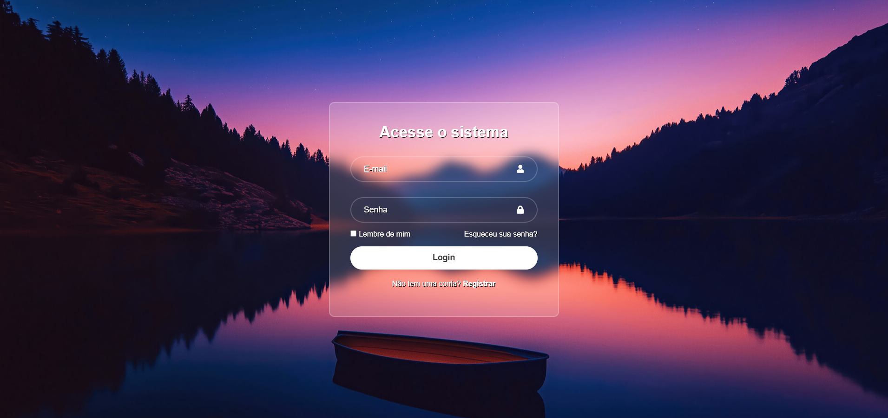
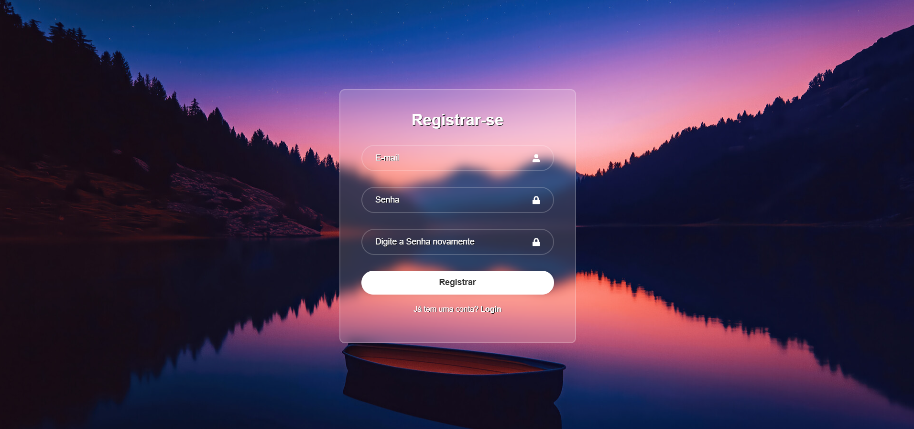

# Telalogin - Sistema de Login

> **Telalogin** é um sistema de autenticação simples desenvolvido com **React**. Ele permite que os usuários acessem suas contas, se registrem e recuperem suas senhas. Este projeto serve como uma base para implementar autenticação em aplicações React.

---

## ✨ Funcionalidades

- **Login**: Tela de login onde os usuários inserem suas credenciais (e-mail e senha) para acessar o sistema.
- **Registro**: Caso o usuário não tenha uma conta, ele pode se registrar facilmente.
- **Recuperação de Senha**: Caso o usuário tenha esquecido a senha, ele pode recuperá-la através de um simples formulário.

---

## 📸 Telas do Sistema

### 1. Tela de Acesso (Login)

Esta é a tela inicial, onde os usuários inserem o e-mail e a senha para acessar o sistema.



### 2. Tela de Registro

Caso o usuário ainda não tenha uma conta, ele pode se registrar nesta tela, preenchendo e-mail e senha.



### 3. Tela de Recuperação de Senha

Se o usuário esquecer sua senha, ele pode acessar esta tela para recuperá-la.


---

## 🚀 Como Rodar o Projeto

### 1. Clone o Repositório

Primeiro, clone o repositório para o seu computador:

```bash
git clone https://github.com/salazarleo/LoginReact
```

### 2. Instale as Dependências

Navegue até a pasta do projeto e instale todas as dependências necessárias:

```bash
cd telalogin
npm install
```

### 3. Inicie o Servidor

Agora, basta rodar o servidor de desenvolvimento com:

```bash
npm start
```

O projeto será iniciado e estará disponível em [http://localhost:3000](http://localhost:3000).

---

## 🛠 Tecnologias Utilizadas

- **React**: Biblioteca JavaScript para construção da interface de usuário.
- **React Router**: Para navegação entre as diferentes páginas (Login, Registro, Recuperação de Senha).
- **React Icons**: Biblioteca de ícones para melhorar a interface.

---

## 🤝 Como Contribuir

Contribuições são bem-vindas! Se você tiver alguma sugestão ou melhoria, fique à vontade para abrir um **Pull Request**.

1. Faça um **Fork** deste repositório.
2. Crie uma nova branch para suas alterações (`git checkout -b feature/alguma-mudanca`).
3. Faça o commit das suas alterações (`git commit -am 'Adiciona nova feature'`).
4. Envie para o repositório remoto (`git push origin feature/alguma-mudanca`).
5. Abra um Pull Request.

---

## 📜 Licença

Este projeto está licenciado sob a [MIT License](LICENSE).

---


### 📌 Observações

Este projeto é apenas um ponto de partida para criar sistemas de login simples em React. A estrutura pode ser facilmente expandida para incluir outras funcionalidades, como autenticação com APIs e armazenamentos de dados mais complexos.

